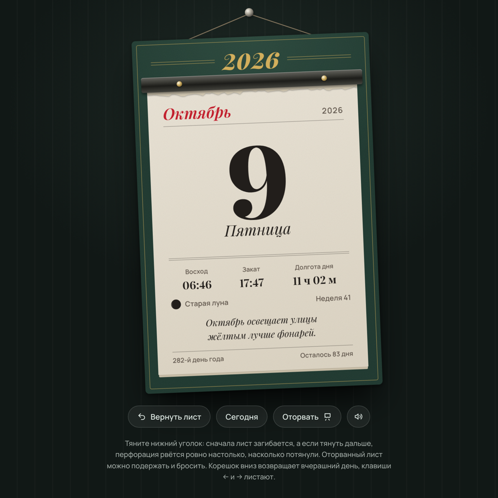

# Tear-off Calendar

**Demo:** https://tear-off-calendar.netlify.app

A wall tear-off calendar in the browser that feels like real paper. One sheet per day. You can curl a corner, tear the perforation bit by bit, and hold a torn-off sheet before throwing it away. The paper sounds are synthesized on the fly. Each sheet shows sunrise and sunset, the moon phase and a short seasonal note.



The interface is in Russian.

## Running

Open `index.html` in a browser. It needs no build step and no server.

## Development

```sh
npx -p typescript@5.4.5 tsc -p .   # calendar.ts -> calendar.js
python3 build.py                   # -> dist/tear-calendar.html, a single self-contained file
python3 tests/regression.py        # regression tests (requires playwright)
```

[CONTEXT.md](CONTEXT.md) explains how it works: the curl geometry, the tearing model, the layers and known pitfalls. It is written in Russian.
